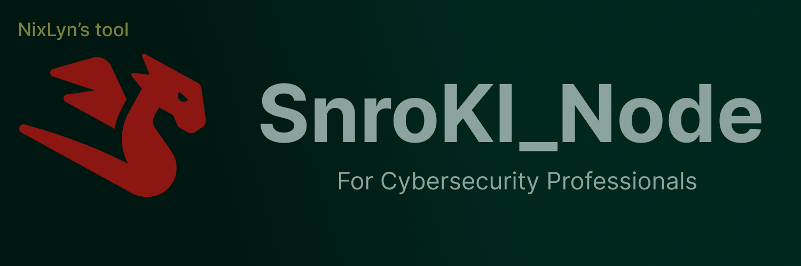
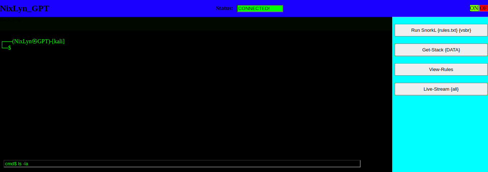

<br>

[](https://twitter.com/DillonBreytenbach) [](https://youtube.com/DillonBreytenbach) [](https://www.linkedin.com/in/DillonBreytenbach/) [](https://instagram.com/DillonBreytenbach) [](mailto:DillonBreytenbach@gmail.com)
<br>
SnrokL_Node is NixLyn’s cybersecurity shell tool that gives Pupple team professionals a safe, fast and more appealing visuals to use a bash scripting  directly from the browser while still maintaing the speed the command prompt brings. SnrokL_Node works well with your already installed kali linux, this tool was developed in mind for penetration testers, SOC and GRC professionals that would love to have that same functional experience from a more friendlier screen. This is a free and open source tool.
<br>
for announcement about new releases, follow the NixLyn mailing list. Our Linkedin page also tracks new features and more functionality across releases.
<br>

# Getting Started  🏁  #

## Step 1 ##

```
git clone https://github.com/NixLyn/SnrokL_Node.git

cd SnrokL_Node/

pip install NodeBase_2/NODE_SRC/requirements.txt

sudo apt update && sudo apt upgrade -y

```

Now you should be able to run all required packages of this project.

## Step 2 ##

### Run the NODE ###

Navigate to NodeBase_2/NODE_SRC/, where you will find the follwing directory tree:


```
├── DATA/ 
├── de_confuse.py
├── File_Man.py
├── listen_1.py
├── main.py
├── node_ruling.py
├── port_figs.py
├── requirements.txt
├── rules.txt
└── snrokly_node.py

```

### Now Run : ###

```
sudo python3 snrokl_node.py

```

If you see :

```
[WEB_SERVER_STARTED]
_

```

Then it's started just fine.
-> You can watch keep the terminal open to the side..


## Step 3 ##

### Web View ###

Open the SOCK_JS_TEST/snrokl_.html file in your browser. 
<br>
You will find a terminal style wevb page, with the text input at the bottom of the page  
<br>

### Usage ###
<br>
You have the option to use either:  

```
cmd$ {cmd}
```
<br>

which will run the given command and return the output
or use:


```
node {option} {argv 1} {argv 2}
```
Current options for _node_ are :

```
node run {rules file} {flags}

node add-rule {rules file} {rule}

node get-stack

node get-file {rules file}

```




